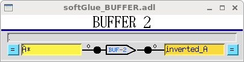
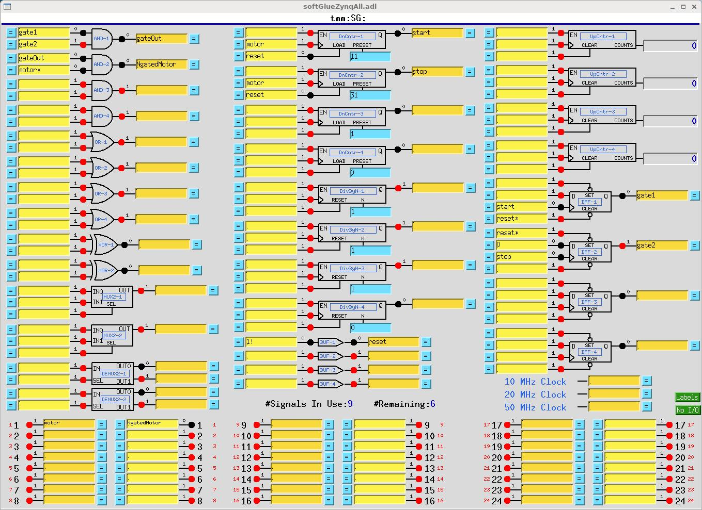

The synApps softGlueZynq module (R2-0)
======================================

- - - - - -

Table of Contents
=================

- [Overview](#Overview)
- [Installation and deployment](<#Installation and deployment>)
- [User's Manual](<#User's Manual>)
- [Additional FPGA components](<#Additional FPGA components>)
- [Miscellaneous configuration](<#Miscellaneous configuration>)
- [Saving and restoring circuits](<#Saving and restoring circuits>)
- [Example circuits](<#Example circuits>)
- [Field wiring](<#Field wiring>)
- [Custom Interrupt Handlers](<#Custom Interrupt Handlers>)
- [Implementation](#Implementation)

- [Overview](#overview)
- [Installation and deployment](#installation-and-deployment)
- [User's Manual](#users-manual)
- [Additional FPGA components](#additional-fpga-components)
- [Miscellaneous configuration](#miscellaneous-configuration)
- [Saving and restoring circuits](#saving-and-restoring-circuits)
- [Example circuits](#example-circuits)
- [Field wiring](#field-wiring)
- [Custom Interrupt Handlers](#custom-interrupt-handlers)
- [Implementation](#implementation)

- - - - - -

Overview
--------

The [synApps](http://www.aps.anl.gov/bcda/synApps) softGlueZynq module enables [EPICS](http://www.aps.anl.gov/epics) users and application developers to construct small, simple, digital electronic circuits, and to connect those circuits to field wiring, all by writing to EPICS PV's. Because the circuits and field connections are defined entirely by EPICS PV's, they can be [autosave](https://epics-modules.github.io/autosave/)d and restored, saved as text files (for example, as [configMenu](https://epics-modules.github.io/autosave/autoSaveRestore.html#configmenu) files), emailed from one user to another, etc. softGlueZynq also provides control over how hardware interrupts are generated by field I/O signals, how they can be dispatched to cause EPICS processing, and how user-written interrupt-service routines can be registered for execution in response to a specified interrupt source. > The name *softGlue* was intended to suggest *glue electronics* implemented by *soft*ware, where *glue electronics* means those little bits of digital circuitry needed to connect two or more larger pieces of digital electronics into a working whole. *softGlueZynq*is a rendition of softGlue for the Xilinx Zynq device, which is the combination of an FPGA and a processor running Linux.

softGlueZynq does this by loading the Zynq FPGA with a predefined collection of circuit elements (logic gates, counters, flip-flops, etc.), whose inputs and outputs are connected to switches controlled by EPICS PV's. softGlueZynq provides a user interface for controlling those switches, allowing inputs and outputs to be marked with user-specified names, and connecting or driving inputs and outputs according to those names.

Here's the underlying idea, schematically:

The box containing `X`, `Y`, and `Z`represents a softGlue component. The 15 wires at the botton of the figure represent the softGlue signal bus. Output `Z` is connected to input `X`, because their switches select the same softGlue signal bus line.

> The synchronizing flipflops are not of much interest to an end user; their purpose is to tell Xilinx routing software how much time it has to get a signal from the input flipflop to the softGlue component (note: clocked on the falling edge), from the softGlue component to the output flipflop, and from the output flipflop through the switches to all input flipflops. This arrangement sets the maximum frequency of signals that can be transported on the signal bus to be half the frequency of the softGlue register clock. Currently, the softGlue register clock is 100 MHz.

- - - - - -

### Requirements

To use softGlueZynq, you must have the following hardware and software:

- #### Hardware
    
    
    - A [MicroZed 7020](http://zedboard.org/product/microzed)
    - A carrier card, such as the [ MicroZed Breakout Carrier Card](http://zedboard.org/product/microzed-breakout-carrier-card)
    - A MicroSD card.
    - A MicroSD card writer.
    
    > softGlueZynq is intended to be useable with any Zynq device, and will certainly be ported to one or more versions of the PicoZed, but the FPGA-load files, databases, and MEDM displays supplied in this version are for the MicroZed 7020. The first version of softGlueZynq was also useable on the MicroZed 7010, but that device's FPGA is too small to contain this version, and it will no longer be supported.
- #### Software
    
    
    - EPICS base, release 3.15.3 or higher.
    - The EPICS [asyn](http://www.aps.anl.gov/epics/modules/soft/asyn) module, version 4.6 or higher.
    - The EPICS extension, [msi](http://www.aps.anl.gov/epics/extensions/msi/index.php), version 1-5 or higher. > This tool is needed to build some softGlueZynq databases.
    - MEDM, or caQtDM, or CSS-BOY, or the ability to adapt some other display manager, or Channel Access client, to implement softGlueZynq's user interface.

> Some of the softGlueZynq databases, displays, and examples presume the availability of synApps modules such as calc and busy, but these are not needed for any essential feature of softGlueZynq. You're probably going to want autosave, release 5.7 or higher, because it makes loading and saving circuits very easy. SoftGlueZynq includes a 16-input scaler and support for the scaler record, which record is in the scaler module.

You do __not__ need to be able to program the Zynq FPGA. In the default implementation, the FPGA content is programmed automatically into the module at IOC-boot time. A Xilinx .bin file is included with softGlueZynq for this purpose. softGlueZynq loads the FPGA on every IOC boot, though it's also possible to reboot the IOC without affecting a running FPGA.

> If you have a copy of the Xilinx Vivado software, you can load your own custom FPGA content into the module, and use softGlueZynq to talk to it. Code and instructions for reproducing the softGlueZynq Vivado project are in softGlueZynq/documentation/Vivado.

### Capabilities

Here are a few examples of the sorts of things that can be accomplished with softGlueZynq and EPICS:

- With no programming at all, softGlueZynq functions simply as a digital I/O module.
- Conditionally send a trigger signal to a detector after every N steps of a stepper motor.
- Conditionally send a trigger signal to a detector after every N(i) steps of a stepper motor, where N(i) is an array of step-interval numbers.
- Gate a detector off during the acceleration and deceleration portions of a steppermotor's motion.
- Send a trigger to a detector precisely 23.003 ms after sending a trigger to a shutter.
- Conditionally trigger the execution of an EPICS record on the change of state of an external signal.
- Implement an extraordinarily smart trigger signal for an oscilloscope.
- Implement efficiently a timer useable by EPICS software, with a time resolution that is much better than the system clock's resolution. (With this, you can for example cause an EPICS database to wait for 0.7 ms.)

#### Implemented circuit elements

In this version of softGlueZynq, the FPGA is programmed with the following circuit elements: - Four AND gates
- Four OR gates
- Four noninverting buffers
- Two XOR gates
- Four D flip-flops
- Two 2-input/1-output multiplexers
- Two 1-input/2-output demultiplexers
- Four 32-bit up counters
- Four 32-bit down counters
- Four 32-bit divide-by-N counters
- Four 32-bit up/down counters
- Four gate & delay generators
- Two quadrature decoders
- One frequency counter
- One one-input, 64 channel histogramming scaler on the softGlue signal bus.
- One one-input, 64 channel histogramming scaler direct connected to field I/O.
- Two "pixelTrigger" components, configured as an x-ray microscope data-acquisition system.
- One seven-input multichannel scaler. (This is actually just the pixelTrigger acquisition system operating in "list" mode.)
- 36 field-input bits (24 LVCMOS, 12 LVDS)
- 24 field-output bits (LVCMOS)
- One 10 MHz clock signal (Clock frequencies can be changed at run time. See [Miscellaneous configuration](<#Miscellaneous configuration>) below.)
- One 20 MHz clock signal
- One 50 MHz clock signal
- One variable frequency clock signal

#### Analog Processor circuit elements

In addition to the above listed components, softGlueZynq includes the ability to handle analog values in much the same way it handles digital values. This is accomplished by encoding analog values as bit streams that can be put on the softGlue signal bus. This is currently rudimentary: only proof-of-principle components have been written, and there is no input or output capability. These circuit elements are in a separate FPGA-load file ("analogProc"), which also includes an abbreviated version of the digital components in standard softGlueZynq.

- Two two-input sum circuits
- Two two-input difference circuits
- Two two-input normalized difference ((a-b)/(a+b)) circuits
- Four low-pass filters
- Two two-input multiply circuits
- Two two-input divide circuits

- - - - - -

Installation and deployment
---------------------------

The simplest way to deploy softGlueZynq is to download and build the module iocZed, which uses softGlueZynq as a support module, and which contains code to load and run it on a MicroZed. iocZed can also include as much or as little of the rest of synApps as you want. It's essentially a custom copy of the synApps xxx module. As delivered, iocZed is ready for all non-VME dependent synApps modules, and will build with whatever modules are defined in `synApps/support/configure/RELEASE`. Even if you don't want to use the MicroZed as a general purpose soft IOC, you're probably going to want modules like autosave and calc. If you want to use the included 16 input scaler with the scaler record, you'll need the scaler module. Before I get started, there are a *lot* of different ways to run Linux, EPICS, and FPGA code on the MicroZed. I'm not an expert, but I found a way that is similar to the way we run vxWorks and soft Linux beamline IOCs at the Advanced Photon Source, and that's what I'm going to describe. We build EPICS and synApps on the read-only file system `/APSshare`, and build IOC-application directories on a read-write file system `/net/s<i>N</i>dserv/xorApps/epics/ioc`. You're going to do whatever you want, of course; I'm just telling you this to make the description more understandable.

### How to get the software

softGlueZynq and iocZed are on on GitHub ([softGlueZynq](https://github.com/epics-modules/softGlueZynq)) ([iocZed](https://github.com/epics-modules/iocZed)) The file [assembleBaseAndSynApps.csh](assembleBaseAndSynApps.csh) is a script you can run to get EPICS base and synApps (including softGlueZynq and iocZed) from web sources. Comments at the bottom of the file detail the edits you'll have to make to get everything to build.

### Building softGlueZynq

The supported way to build SoftGlueZynq and iocZed is to cross compile. You will need a copy of the [Xilinx Software Development Kit](https://www.xilinx.com/products/design-tools/embedded-software/sdk.html). (You'll need to get a license, but the license is free.) In the file [MicroZed\_PetaLinux\_Prep.txt](MicroZed_PetaLinux_Prep.txt) is a detailed recipe explaining how to configure EPICS base to cross compile for the MicroZed's linux-arm processor, and how to do some other stuff that you won't need to do unless you write custom FPGA components. - Edit `softGlueZynq/configure/RELEASE`, to specify the paths to EPICS\_BASE, ASYN, and any other modules you want.
- Edit `iocZed/configure/RELEASE`, to specify the paths to SUPPORT.
- Run `make` in the top-level directories of softGlueZynq and iocZed, using the same `make` executable used to build EPICS base. > The softGlueZynq build will issue a warning that it can't expand all macros in substitution files. This is not an error; unexpanded macros are intended to be defined at boot time. (Note that version 1-4 of `msi`returns an error, which causes the softGlueZynq build to fail, after writing a database file that contains unexpanded macros.)

### Deploying softGlueZynq to an IOC

A PetaLinux operating system image is included with softGlueZynq. This image sets up the Linux directory tree and starts Linux. PetaLinux is a memory-resident OS, so nothing you do in the PetaLinux file system will ever survive a reboot. For this reason, we put all the EPICS code on an served file system, have the MicroZed mount that file system, and run EPICS from there.

Let's say you want to use the IOC prefix "yyy:". On a workstation, in a copy of iocZed:

- `make distclean`
- `changePrefix zzz yyy`
    > changePrefix is a script in the synApps utils directory. Its purpose is to customize a copy of the synApps xxx or iocZed module as an IOC-boot directory.
- `make`
- `chmod a+w iocBoot/iocyyy`
- `chmod a+w iocBoot/iocyyy/autosave`
- `chmod a+x iocBoot/iocyyy/run`
- edit `start_epics_yyy` to set `EPICS_APP` and `EPICS_APP_ADL_DIR`.
- edit `iocBoot/iocyyy/run` to set the environment variable `PATH` to the directory that has executables for linux-arm.
- edit `iocBoot/iocyyy/softGlueZynq.iocsh` to select the "system()" command that will load FPGA content matching your MicroZed version.
- In softGlueZynq/documentation/SD\_card, find the directory that matches the MicroZed version you have. Untar it, edit `userConfig`according to instructions in that file. > The strategy for mounting NFS disks and arranging for directory names to look the same on the MicroZed as they looked on the workstation that built EPICS software is likely to change, and it must match Linux-initialization code that will have been built into `BOOT.BIN` and `image.ub`, so I'm not going to document it here.
- Copy `userConfig`, `BOOT.BIN` and `image.ub` to a MicroSD card, and insert the card in the MicroZed.
- Ensure that the MicroZed's jumpers are set to boot from the MicroSD card: JP3: 2-3, JP2: 2-3
- Power the MicroZed. If it succeeds in getting an IP address via DHCP, ssh to root@&lt;IP address>, or to the user account you specified in userConfig.
- See if NFS mounts succeeded. If not, you might be able to do them by sourcing doMounts.sh.
- The alias `iocgo` should take you to the IOC directory.
- Type `./run` to start the IOC.

#### Configuring softGlueZynq (editing softGlueZynq.iocsh)

You shouldn't need to modify anything here, except to select the `system()` command that loads the copy of softGlue\_FPGAContent\_70x0.bin for the MicroZed model you have.

##### User Callable Functions:

-  ```initZynqSingleRegisterPort(const char *portName, const char *componentName)```

    Initialize softGlueZynq signal-name support.

    Example:

    ```
    initZynqSingleRegisterPort("AXI0", "softGlue_")
    # softGlue registers
    initZynqSingleRegisterPort("AXI1", "softGlueReg32_")
    ```

- ```initZynqInterrupts(const char *portName, const char *componentName)```
    
    Initialize softGlueZynq interrupt support.
    
    Example:
    
    ```
    initZynqInterrupts("AXI0INT", "softGlue_")
    ```

### Customing softGlueZynq FPGA content and Petalinux code

The Vivado and Petalinux projects are included in softGlueZynq, in the event you want to customize either or both of them. See the file [MicroZed\_PetaLinux\_Prep.txt](MicroZed_PetaLinux_Prep.txt) in the softGlueZynq documentation directory, which will lead you to documentation/Vivado and/or documentation/PetaLinux.

- - - - - -

User's Manual
-------------

Most of the essential user-interface information — how to connect signals, what the display elements mean, etc. — is contained in the descriptions of the "User Menu" and "AND" sections below. The remaining sections are mostly for completeness, though some circuit elements do require further explanation, and the counter sections introduce new display elements for registers containing decimal numbers.

We're going to have a little trouble with the meanings of "input" and "output", because they imply a viewpoint, and because we're going to be taking three different viewpoints: those of EPICS records, circuit elements, and field-wiring connectors. Usually, in EPICS, we think of an output as something to which an EPICS record can write, but that definition would be awkward here, because it would eventually require us, for example, to refer to the output of an AND gate as an "input". You just can't discuss digital circuitry intelligibly from that viewpoint.

Therefore, in this documentation, "input" and "output" will normally be from the viewpoint of one of the circuit elements we'll be wiring. Field I/O will be an exception, because it's most conveniently discussed from the viewpoint of the field-wiring connector.

### MEDM user interface

- - - - - -

- User Menu
    
    
    
    `softGlueZynqMenu.adl` is the top softGlueZynq display, which serves mostly to call up other displays. The menu labelled `READ PERIOD` specifies the period at which the values of all signals are sampled for display to the user. `#SIGS IN USE`shows the number of signal names you have defined.
    
    > Most softGlueZynq displays are not interrupt driven. (That would be a disaster, because inevitably some signals will change state at high frequency.) So, the states of inputs and outputs must be sampled periodically, for display to the user. We've found that it's confusing for users if the poll period is greater than around 1 second. We've also found that polling everything at .1 second uses around 2 percent of the MicroZed's CPU.
    
    - - - - - -
- AND
    
    
    
     On the left of the AND gate are the inputs, each comprised of a blue "= button", a yellow text-entry field, a number, and what's intended to look like a red LED. On the right are essentially the same things in reverse order, but an output's text-entry field is a different color. The text-entry fields are used to connect signals together, and the color difference is intended to remind you of the only rule governing signal connections: if you connect two or more outputs together, those outputs won't work.
    
    > softGlueZynq outputs are engineered to ensure that you can't break anything by connecting outputs together, but the circuit won't be useful until you fix the error, because the states of outputs connected together are undefined. Currently, softGlueZynq doesn't signal this error by putting offenders into an alarm state.
    
    The yellow text-entry box controls an input. You have three options:
    
     __1. Leave empty.__   
    Inputs with empty text-entry boxes default to logic value 1. 
     __2. Enter a string that begins with a number.__   
    This directly writes a logic value (optionally, a pulse) to the input.
    
    softGlueZynq will parse everything that looks numberish, and convert to a floating point value. This sets the input to a logic value: 0 if the nearest integer to the converted value is zero, 1 if it's not.
    
    > Allowing floats, and extra characters after the number makes it easier to drive softGlueZynq inputs with calcout records, replies from serial devices, etc.
    
    The strings "0!" and "1!" (possibly followed by other ignored characters) direct softGlueZynq to write a pair of logic values: "0!" writes "0" followed immediately by "1"; "1!" writes "1" followed immediately by "0". The time interval between writes is system dependent, and not at all guaranteed, but it should be much smaller than the interval you could achieve from separate writes. On an MicroZed 7020, I measure around 3.5 μs.  
    
    __3. Enter a string that begins with something other than a number.__   
    This *names* the signal, and connects it to all other signals with the same name (or with the same name followed by '`*`', as described below). Case is significant in comparing signal names.
    
    > Note that a "signal", as the word is used in this documentation, is a named connection between softGlueZynq circuit elements. It might be more intuitive to think of a "signal" as a wire, to avoid confusing it with, say, field I/O.
    
    
    If you want to use the inverted value of a signal for input to some component, append '`*`' to the signal name. This doesn't change the signal that the input is connected to, but just tells softGlueZynq to run the signal through an inverter before applying it to the input. Note that output signal names may not end with '`*`'.
    
    In MEDM, you can use Drag-And-Drop to connect a named signal to some other signal. When you drop, MEDM will put the PV name of the signal you dragged from. When you press &lt;Enter>, softGlueZynq's device support will write the signal name of the source PV to the destination PV.
    
    In caQtDM, you can select the text of a signal name, and use Copy/Paste (^C/^V) to copy the signal name from one text-entry box to another.
    
    Whatever option you choose, you can define at most fifteen different signal names. When you try to define the 16th name, softGlueZynq will erase whatever you wrote, and put the record into the "INVALID" alarm state. (But note, for example, that `reset` and `reset*` are not different signal names, because the trailing '`*`' is not regarded as part of the name; it merely describes how the signal should be used.)
    
    Text-entry boxes for output signals won't accept names beginning with a number, or ending with '`*`'. (softGlueZynq will simply strip the offending characters, and leave the rest.)
    
    > A signal name beginning with a number can only be a direct-write command; it cannot connect things together, because the leading number would be misinterpreted by input-signal-name parsing as a direct-write command. Output-signal names ending with '`*`' are logically sensible, but are not permitted; this simplifies the implementation of '`*`' appended to input-signal names.
    
    A signal's blue "= button" is used to find all other signals to which the signal is connected. While a signal's "= button" is pressed, input signals connected to it are bordered in green, and output signals connected to it are bordered in orange. If you ever see two or more orange borders at the same time, you have outputs connected together, and your circuit won't work.
    
    The little red and black filled circles (LED's), and the numbers next to them, display the states of their signals. These display elements are updated at the period specified in the `softGlueZynqMenu.adl` display. If you want the EPICS PV name corresponding to a signal's logic value, this is the PV name to use.
    
    For completeness, here's the truth table for an AND gate:
    
    | input1 | input2 |  | output |
    |---|---|---|---|
    | 0 | x |  | 0 |
    | x | 0 |  | 0 |
    | 1 | 1 |  | 1 |
    
    > 'x' means "either 0 or 1".
    
    - - - - - -
- OR
    
    
    
    | input1 | input2 |  | output |
    |---|---|---|---|
    | 0 | 0 |  | 0 |
    | 1 | x |  | 1 |
    | x | 1 |  | 1 |
    
    - - - - - -
- BUFFER
    
    
    
    The purpose of the buffer element is to permit EPICS to drive several softGlueZynq inputs by writing to a single PV, without using up a more valuable circuit element, such as the XOR gate below.
    
    - - - - - -
- INVERTING BUFFER
    
    
    
    There is no inverting buffer - or any other inverting gate - in softGlueZynq. Signal inversion is accomplished by appending '\*' to the name of a signal used as as input to any logic element, as demonstrated above for the buffer element. Note that '\*' appended to the name of an output signal will be removed.
    
    - - - - - -
- XOR
    
    
    
    | input1 | input2 |  | output |
    |---|---|---|---|
    | 0 | 0 |  | 0 |
    | 0 | 1 |  | 1 |
    | 1 | 0 |  | 1 |
    | 1 | 1 |  | 0 |
    
    - - - - - -
- D FlipFlop
    
    
    
    The input signal labelled ">" is the "clock" input. Unlike other signals, clock inputs are edge sensitive. All clock inputs in softGlueZynq act on the rising edge of the input signal.
    
    The open circle ("bubble") in the `SET` and `CLEAR` inputs' signal paths indicate that these signals are inverted before being used. Thus, applying '0' to the `CLEAR` input causes the output to be "cleared" (given the value 0). `SET` and `CLEAR`are asynchronous: they act immediately, and don't wait for the next clock edge.
    
    | SET | CLEAR | D | > (clock) |  | Q |
    |---|---|---|---|---|---|
    | 0 | 0 | x | x |  | undefined |
    | 0 | 1 | x | x |  | 1 |
    | 1 | 0 | x | x |  | 0 |
    | 1 | 1 | any | rising edge |  | DBEFORE (value D had immediately before the rising edge of the clock signal) |
    
    - - - - - -
- 2-Input Multiplexer
    
    
    
    When `SEL==0`, `OUT=IN0`. When `SEL==1`, `OUT=IN1`.
    
    - - - - - -
- 2-Output Demultiplexer
    
    
    
    When `SEL==0`, `OUT0=IN`, and `OUT1` is undefined (currently 0). When `SEL==1`, `OUT1=IN`, and `OUT0` is undefined (currently 0).
    
    - - - - - -
- Up Counter (32-bit Counter)
    
    
    
    `EN==1` enables the clock (">") input, whose rising edge increments the counter value.
    
    `CLEAR` is asynchronous, and acts whether or not `EN==1`.
    
    - - - - - -
- Down Counter (32-bit Preset Counter)
    
    
    
    `EN==1` enables the clock (">") input, whose rising edge decrements the counter value. When `LOAD==1` the counter is loaded immediately with the value applied to the `PRESET` input (whether or not `EN==1`). While `LOAD==1`, the counter does not count down. While `LOAD==0` and `EN==1`, a rising edge at the clock input decrements the counter. When the counter value reaches `0`, the output `Q` goes to `1`; the next rising edge of the clock returns `Q` to `0` (regardless of the states of `EN` and `LOAD`).
    
    - - - - - -
- 32-bit Divide By N
    
    
    
    `EN==1` enables the clock (">") input. Every `N`'th rising edge of the clock drives `Q` to `1`. The next rising edge returns `Q` to `0`. This behavior produces the correct number of rising edges of the output signal, but it does not guarantee the same number of falling edges. Therefore, using an inverted copy of the output to clock downstream electronics will in some cases have inconsistent results. When `N`==`1`, the divide circuitry is bypassed, and the clock is connected directly to `Q`, if `EN==1`, or is set to 0 if `EN==0`.
    
    The `RESET` signal loads the counter with `N`, so that `Q` will be driven to `1` after `N` rising edges of the clock. `RESET` does not clear the output `Q`. If `Q`is `1`, it will be cleared on the first rising edge of the clock.
    
    - - - - - -
- 32-bit Up/Down Counter
    
    
    
    `EN==1` enables the clock (">") input. `CLEAR==1` sets the current count and the output value `Q` to zero. When `UP/DOWN==1` the counter counts up. `LOAD` sets the current count to `PRESET`
    
    - - - - - -
- Quadrature Decoder
    
    
    
    This circuit converts a pair of digital quadrature signals `A, B`(for example, signals from an encoder) into a pair of `STEP, DIR`signals. `A` and `B` are samples on rising edges of the `CLOCK` signal. If either have changed since the last rising edge, the travel direction implied by the change is output to `DIR`, and a pulse is output to `STEP`. The pulse width is equal to the period of the `CLOCK` signal, and the input frequency may not be greater than half the clock frequency.
    
    - - - - - -
- Gate&Delay Generator
    
    
    
    The rising edge of the input signal `IN` will appear at `OUT` after `DLY` periods of the clock `>`. If `WIDTH` is nonzero, it specifies the width in clock periods of the output pulse. If `WIDTH==0`, the width of the input signal will be used.
    
    There is a faster version of this component, with 4 ns time resolution, connected directly to field I/O, and clocked by a dedicated 250 MHz clock. The fast versions are controlled by the same DLY and WIDTH registers as the normal (softGlue-bus-connected) versions, but they only use the lower 16 bits of those registers. fastGate&Delays 1-4 are hard wired to field inputs FI1-4, respectively. By default, the outputs are not connected to field outputs. You can change this by selecting "Configure" from the softGlueZynqMenu display. See [Miscellaneous configuration](<#Miscellaneous configuration>) below.
    
    - - - - - -
- Frequency Counter
    
    
    
    This component counts the number of rising edges per second presented to the ">" input.
    
    - - - - - -
- 10 MHz internal clock
    
    
    
    10, 20, and 50 MHz clocks, and one clock whose frequency can be varied with roughly .1 MHz resolution, are available to softGlueZynq circuitry as free standing outputs.
    
    > All clock frequencies can be changed at run time. See [Miscellaneous configuration](#Miscellaneous
    > configuration) below.
    
    - - - - - -
- Field I/O
    
    
    
    This display allows you to connect field I/O signals to each other and to softGlueZynq circuits. Note that a "Field Input Bit" looks like and behaves as a softGlueZynq *output*, because what you're actually controlling is the output of a buffer driven by the field-input signal. Similarly, a "Field Output Bit" looks like and behaves as a softGlueZynq *input*, because you're actually controlling the input of a buffer that drives the field-output signal.
    
    The signals in this display are the field inputs or outputs connected to MicroZed I/O pins. As currently implemented, softGlueZynq supports 24 inputs and 24 outputs configured for LVCMOS33, and 12 inputs configured for LVDS. The LVCMOS33 outputs are TTL compatible, but the inputs must be limited to around 3.5 V.
    
    > You can change the "CONNECTOR #" strings in this display — for example, to support a custom signal-breakout module, or to give the I/O signals application-specific names. The strings are defined in `softGlueZynqApp/Db/softGlueZynq_FPGAContent.substitutions`, as the macro `IOPIN` supplied to `softGlueZynq_FieldOutput.db`and `softGlueZynq_FieldInput.db`.
    
    - - - - - -
- Field I/O Interrupt support
    
    
    
    Field I/O lines supported by softGlueZynq can generate interrupts on rising edges. You control this by setting the "INTERRUPT ENABLE" menu to "Rising", or "None", respectively. Interrupts are masked by softGlueZynq's interrupt handler until the current interrupt has been serviced.
    
    When an interrupt occurs, you can have the signal value written to an EPICS PV, by writing an EPICS link description into the purple box labelled "ON INTERRUPT, WRITE SIGNAL VALUE VIA THIS LINK".
    
    *For interrupts that may occur too closely spaced in time for softGlueZynq's EPICS-record-processing interrupt-response mechanism to handle reliably, see "Custom Interrupt Handlers", below.*
    
#### About EPICS links

In softGlueZynq displays (and in most other synApps displays), standard EPICS links are displayed as purple text-entry boxes, in which you describe the link you want to make. For purposes here, an EPICS link description is the name of an EPICS PV, followed by one of the following link attributes:

| NPP | (default) write value, but do not cause processing. |
|---|---|
| PP | write value and cause processing (if the record containing the PV is "Process Passive", which means that it's SCAN field has the value "Passive").   You should use this attribute unless you have some reason not to use it. |
| CA | write value and let the record containing the PV decide whether or not to process. |

> EPICS will tack on the string " NMS". This alarm-propagation attribute is not something end users need to worry about.

For example, to cause a link to write effectively to the top input of the first AND gate (whose PV name is `zzz:softGlueZynq:AND-1_IN1_Signal`, you would write the following into a purple box:

```
zzz:softGlueZynq:AND-1_IN1_Signal PP
```

If you only write the PV name, EPICS will supply the link attribute `NPP`, and your link will write a value, but the value won't have any effect until the next time the record processes. (For most PV's in softGlueZynq, the value written by an NPP link won't even be displayed until the record processes.) __Note:__ if the link writes to a PV in a different IOC, the specified link attribute will be ignored, and the attribute "CA" will be used instead.

- - - - - -

- Convenience
    
    
    
    This display controls two pulse generators implemented in EPICS, with links allowing them to write to a softGlueZynq input (that is, to a yellow box), and, similarly, two clock generators implemented in EPICS. The display also has MEDM related-display callups for two busy records,
    
    > The use of EPICS links (the purple boxes in the above display) is described above in the section "About EPICS links", in the documentation of "Field I/O Interrupt support".
    
    - - - - - -
- BusyRecord
    
    
    
    This display controls the value, output link, and forward link of a busy record. In the anticipated use with softGlueZynq, one would have some EPICS record outside of softGlueZynq set the busy record to "Busy" (using a PP link), and arrange for a softGlueZynq interrupt bit (see "Field I/O Interrupt support", above) to use its EPICS-output link to clear the busy record to "Done" (using a CA link).
    
    > The use of EPICS links (the purple boxes in the above display) is described above in the section "About EPICS links", in the documentation of "Field I/O Interrupt support".
    
    > It's important to __set__ a busy record to "Busy" using a PP link, because the purpose of a busy record is to represent some external processing as EPICS processing. This allows EPICS' execution tracing to signal the completion of the processing. EPICS only traces processing started or propagated with a PP link. It's important to __clear__ a busy record to "Done" with a CA link, because an EPICS PP link will decline to process any record that is already processing. The busy record is written so that a CA put will succeed in clearing it and causing its processing to appear done to EPICS.

- - - - - -

Additional FPGA components
--------------------------

The following components are not general purpose, but are specific to an experiment type or a measurement technique. Components in this category are not guaranteed to be compatible with previous or future versions of themselves. These are custom components, and they will evolve with user requirements.

- 16 Input Gated Scaler
    
    
    
    This is a 16-input gated scaler with the first input dedicated to determining the dwell time. Although the scaler16m display has `Gate` fields for all inputs, the fields are currently fixed by the FPGA content, and by the Epics device support code. Inputs 2-16 are hardwired to field inputs 2-16. Field input 1 is available for use as a gate or clock.
    
    > Note that the scaler as shown here requires the synApps SCALER module, because that module defines the EPICS scaler record. If the SCALER module is unavailable or unwanted, you can drive the scaler with softGlueZynq's SGscaler.db database. But also note that this database is unsupported, and was intended only as a way for me to learn how to write scalerRecord device support for this scaler hardware.
    > 
    > The frequency accuracy of softGlueZynq's 10 MHz clock was measured by comparing it with the 10 MHz output of a Keysight 33600A waveform generator, which claims few ppm accuracy. softGlueZynq's 10 MHz clock differed by around 24 ppm on the MicroZed I used for the measurement. I don't know if this is representative of MicroZeds genrally, or how the frequency varies with temperature.
    
    The connections `CNT`, `STOP`, `CLEAR`, and `READ`, and the `PRESET` value are driven by EPICS scalerRecord device support, if the scaler database is loaded. The output `Q` produces a short positive going pulse when the scaler is done counting. The output `CNTG` goes high when the scaler starts counting, and goes low when the count is done, either because counter 1 has reached its preset, or because the user has cleared the scaler record's CNT field (that is, pressed the "Done" button).
    
    The user is responsible for the following connections:
    
    
    1. connecting a softGlue clock signal to the scaler, and telling the scaler record the clock frequency, as shown above.
    2. enabling the scaler (the `EN` input), either with a constant value, or with some softGlue signal name, as shown above.
    3. connecting the scaler's `Q` output to field I/O output 16, and setting that bit's interrupt enable to "Rising", as shown below. The scaler record's device support currently is hard coded to use this interrupt source.
    
    
    
    - - - - - -
- Histogramming Scaler
    
    
    
    This is a one-input scaler with 64 time bins. While `EN==1`, it counts pulses presented to `DET` into one of 64 scalers. When a rising edge is presented to `SYNC`, the first scaler is selected. Each time a rising edge is presented to the clock input, the next scaler is selected. (Thus, the clock performs as the "channel advance" signal of a multichannel scaler.) When `CLEAR` is high, all counters are cleared.
    
    Scaler values are routed via DMA to EPICS, which collects them using an aSub record, and presents them as an array of counts as a function of the channel number - time elapsed since the most recent `SYNC` pulse.
    
    There is a version of this component that can channel advance at up to 250 MHz. In the high speed version, the SYNC input is connected to the Q output of fastGate&Delay-3, whose input is hardwired to FI-3; the DET input is connected to the Q output of fastGate&Delay-4, whose input is hardwired to FI-4; and the clock input is hardwired to a dedicated clock generator.
    
    
    
    - - - - - -
- 2D Microscope Data-Acquisition System ("pixelTrigger")
    
    
    
    This system accepts four interferometer or encoder signals (digital quadrature), which are the X and Y positions of a microscope lens and sample, and produces pixel maps of detector data that were acquired in softGlueZynq counters as the interferometer signals varied.
    
    The user specifies how many interferometer edges are to represent the X and Y sizes of the pixels. The circuit subtracts lens and sample positions to yield the location, on the sample, of the focal spot. When the focal spot crosses a pixel boundary, the circuit generates a data-acquisition trigger, which is used internally and is also available externally. Internally, the trigger causes the X,Y coordinates of the pixel, and the current values of seven counters, to be copied into a FIFO for transmission to EPICS, and it clears the counters to begin acquisition in the new pixel. The trigger pulse width is controllable with the "ACQ TIME" input, in units of the clock period. This is intended to limit the trigger rate to a value that external data acquisition electronics (a camera or a multichannel scaler, perhaps) can handle.
    
    EPICS software maintains seven 32-bit deep pixel maps into which it histograms counter data according to the pixel coordinates in which those data were acquired. At the right, above, are 16-bit images generated from the pixel maps, in which are shown the X/Y trajectory of the focal spot as mechanical vibrations travelled through the instrument. (The "instrument," in this case, is my desktop, on which are interferometer heads and fixed mirrors pretending to be a microscope. The mechanical vibrations are just me knocking on the desktop.) caQtDM is required for the image display, because MEDM has no 2D display widget for live data.
    
    The maximum rate (number of pixel-boundary crossings per second) is around 400,000 pixels/s. This is determined by the worst case interrupt latency of the Linux processor, because EPICS must start a DMA transfer to read the FIFO before it fills up.
    
    Here's a video demonstration of pixelTrigger:   Your browser does not support the video tag.

    - - - - - -
- 8/24-word event generator ("new scalersToStream")

    

    This new version of the scalersToStream component that was used in the '2D
    Microscope Data-Acquisition System ("pixelTrigger")' above can generate either
    8-word or 24-word data-acquisition events and write them to a FIFO from which
    EPICS can get them via DMA. When a rising edge is seen at the "CHADV" inout, an
    8-word event is acquired; when a rising edge is seen at the "IM TRIG" input is
    seen, a 24-word event is acquired. The first 8 words of this event are the same
    words acquired in an 8-word event.
    
    At the beginning of the acquisition of a microscope 2D image, one wants the
    FIFO emptied of any previously acquired data. This is done by sending a
    negative-going pulse to the "RESET" input. This clears the FIFO and resets the
    DMA. Unfortunately, the DMA driver we are using stops working after this
    operation. Until we fix the problem, it is worked around by unloading and
    reloading the driver. This can be done by the root user by issuing the following
    command: "rmmod dmaproxy; modprobe dmaproxy". EPICS accomplishes this by
    executing the record, `$(P)resetDMA`, in response to an interrrupt generated by
    the reset signal, as previously described in "Field I/O Interrupt support".
    
    After the last data-acquisition has been seen, there will be acquired data
    left in the FIFO. These data can be sent to EPICS by sending a positive-going
    pulse to the "FLUSH" input.

    - - - - - -
- Socket server

    Because the data-acquisition system can acquire
    around 8 MB/s, and saveData files are limited to 2 GB, the sscan record can
    acquire data for only around 4 minutes. Microscope scans are longer than that,
    and anyway users want data written via a socket server because that's what they
    want.
    
    So softGlueZynq has a socket server, and a 40 MB circular buffer from which
    the server extracts acquired data, in `softGlueApp/src/acquireDmaAsub.c`.  There
    is an example socket client, `acquireSocketClient.c`, in `softGlueApp/src`.

    - - - - - -
- Waveform generator ("block RAM")

    
    
    softGlueZynq has two block RAM components in the FPGA, with drivers in the
    FPGA allowing them to be written to from EPICS and read in the FPGA to drive
    DACs. The intended purpose is to implement trajectory scans by writing analog
    values to the programming-voltage inputs of piezo controllers. The two
    components are different because the fast scan axis is merely a repeated
    waveform, while the slow axis contains a matching trajectory that must be added
    to in order to move from one fast-scan line to the next.
    
    There is python code for writing to these block RAMs to program a snake scan,
    and a Lissajous scan: [blockRAM_scan.py](blockRAM_scan.py), which can
    also serve as an example of how to write to block RAMs from EPICS.
    
    To cause the waveforms to be output from the block RAMs, first send negative
    going pulses to the "OUTEN" inputs (here, `acq_bnp:SG:driveRAM_en_Signal` and
    `acq_bnp:SG:driveRAMx_en_Signal`). This causes the components to set initial
    addresses to 0 and otherwise make themselves ready to send waveforms.

    - - - - - -
- Coordinate rotation

    
    
    The coordinate rotation component accepts two 32-bit (X,Z) values (hard wired
    in the FPGA -- not seen in the display) and rotates them to produce (X',Z')
    values. The original purpose was to accept X and Z interferometer readings and
    convert them at ~10 kHz to (X',Z') so they can be used as feedback information
    for piezo controllers. The Bionanoprobe has an X,Y,Z scanning stage on top of
    the rotation stage, and we want to use lab-frame interferometers in the PID
    loops of rotated-frame piezos.
    
    The required matrix multiplication in the FPGA is implemented with signed
    integer arithmetic, but the sines and cosines are less than one, so they are
    premultiplied in EPICS by 1024, and the resulting values are divided by 1024 in
    the FPGA.

    - - - - - -
- PID controller

    
    
    Following this paper, [DigitalPIDControllers_2011.pdf](https://openlab.citytech.cuny.edu/?get_group_doc=4784/1393258757-DigitalPIDControllers_2011.pdf),
    I implemented a PID controller using High Level Synthesis. (See
    `/home/beams0/BCDA1/zynq/Vitis_HLS_Projects/hls_pid.cpp`) I also implemented an
    FPGA component to drive the PID, `drivePID.v`.

    - - - - - -
- Pulse train

    
    
    A continuous train of pulses is enabled by writing 1 to the Inp input. The
    period of the pulses is Period cycles of the Clk input. The pulse width is Width
    cycles of Clk. If Width is 0, a 50% duty cycle is selected. If Width is larger
    than Period it will silently be treated as Period-1.
    
    The number of pulses delivered in response to a short positive-going pulse at
    Inp is N. If Inp remains at 1 after the Nth pulse is started, a new train of N
    pulses will begin, separated from the last pulse as the N pulses were separated
    from each other.
    
    While Dis is 0, no pulses will be sent, and internal counters for period,
    width, and number of pulses will be zeroed.

    - - - - - -

Miscellaneous configuration
---------------------------

There are several features of softGlueZynq that are configurable by the end user. Some of these are controlled with the softGlueZynqConfig display shown below.


- streamMux The pixelTrigger, histogramming scaler, and fast histogramming scaler all use the same data path from the FPGA to EPICS, but only one of them can use it at a time.
- Selected field-I/O points The fast Gate&Delay generators make sense only if connected directly to field I/O, because if they were connected to the softGlue signal bus, their inputs and outputs would be clocked by the softGlue register clock, and this would defeat the purpose of these components. Accordingly, the fast Gate&Delay generators are connected to input pins 1-4, and can be connected to output pins 9-12.
    
    The variable clock (fast histogrammer clock) can be connected directly to output pin 24.
- Clock frequencies You can change the frequencies of any of the six clocks used in softGlueZynq, but you need to know what you're doing if the changes are to be useful. Some frequencies aren't stable. You should verify the frequency with the frequency counter before relying on it.
    
    
    1. You should probably never change the frequency of the softGlue-register clock.
    2. The nominally 10, 20, and 50 MHz clocks can be changed to frequencies in the range 6-50 MHz, with roughly 5 MHz resolution.
    3. The fast Gate&Delay clock can be changed to a frequency in the range 6-300 MHz, with roughly 5 MHz resolution.
    4. The fast histoScaler clock can be changed to a frequency in the range 5-600 MHz, with roughly 0.1 MHz resolution.

Saving and restoring circuits
-----------------------------

 softGlueZynq circuits can be saved and restored using [autosave](https://epics-modules.github.io/autosave/), autosave's *configMenu* facility, [BURT](http://www.aps.anl.gov/epics/extensions/burt/index.php), or any channel access client that can read and write PV's. configMenu is particularly handy, because it's driven by EPICS PVs, and because it saves a time-stamped backup copy of every file it overwrites. Whichever method you use, you may need to clear softGlueZynq signal names before loading a circuit, because loading over an existing circuit could temporarily exceed the available number of signal names. (Alternatively, you could simply load twice, and be confident that the second load will succeed.)

#### Saving and restoring circuits with autosave's configMenu facility

Note that the supplied copy of softGlueZynq.iocsh is already configured to use configMenu. The following description is just to document how it's done.


If you have autosave R5-1 or higher, you can use configMenu to save and restore circuits. (autosave R5-7 supports an unlimited number of circuits.) Here are the steps needed to implement a menu of softGlueZynq circuits, and to give the user a GUI display for saving and restoring them. (In the following, SG is the name of this instance of configMenu. The files it loads and saves will be named "SG\_&lt;*config Name*>.cfg". For examples, the configMenu instance pictured above has files named "SG\_clear.cfg", "SG\_encoderTest.cfg", etc.)

> 1. In the IOC's startup directory, create an autosave request file, which I'll call "SGMenu.req", with the following content: 
    ```
    file configMenu.req P=$(P),CONFIG=$(CONFIG)
    file softGlueZynq_settings.req  P=$(P),H=$(H)
    ```
> 2. Uncomment the following line in the IOC's copy of `softGlueZynq.cmd`: 
    ```
    dbLoadRecords("$(AUTOSAVE)/asApp/Db/configMenu.db","P=zzz:,CONFIG=SG")
    ```
> 3. Add the following line to `st.cmd`: 
    ```
    create_manual_set("SGMenu.req","P=zzz:,CONFIG=SG")
    ```
> 4. Add an MEDM related-display entry to bring up the configMenu.adl display. 
    ```
    label="SGMenu"
    name="configMenu.adl"
    args="P=zzz:,CONFIG=SG"
    ```

softGlueZynq includes configMenu files (\*.cfg) for standard example circuits in the iocBoot/iocsoftGlueZynq directory. In actual use, these .cfg files would be placed in your application's iocBoot/ioczzz/autosave directory. For more information on configMenu, see the autosave documentation.

- - - - - -

Example circuits
----------------

The following circuits have been tested and saved as configMenu .cfg files, as described above (see *Saving and Restoring Circuits*). The .cfg files are in iocBoot/iocsoftGlueZynq.

1. #### Motor-pulse gate 
    
     Positive-going pulses can be gated with an AND gate, by applying the signal to one input of the AND gate, and setting the other input to 0(1) to deny(allow) passage through the gate. Negative-going pulses can be gated with an OR gate, by applying the signal to one input of the OR gate, and setting the other input to 0(1) to allow(deny) passage through the gate.
2. #### Gated scaler
    
    *`gatedScaler.cfg`*
    
    This circuit implements four counter channels, a time base to control counting time, an overall gate, and additional circuitry to control starting, stopping, and processing of the count-value records. Note that the scaler is controlled by a busy record from the softGlueZynq convenience database, so that client software can discover when counting is finished in the standard EPICS way. See [gatedScaler.txt](gatedScaler.txt) for more details.
    
    
3. #### Four independent start-time/stop-time pulses
    
    `fourPulses.cfg`
    
    This circuit produces four separate pulse signals, which start at specified start-delay times after (the falling edge of) an initial start pulse, and which last for specified pulse-length times. It uses four DnCntr's to implement the start-delay times, and four DivByN's to implement the pulse-length times. Times are specified as multiples of the (100 ns) clock period (`PRESET` for the DnCntr's; `N` for the DivByN's), and these numbers must be greater than or equal to 1. The pulse sequence starts on the falling edge of the signal `BUF-1`, written by a periodically scanned EPICS record (one of the softGlueZynq convenience clocks). One spare signal name is available, however, so the pulse sequence could also be started by an external signal.
    
    
4. #### Motor-pulse accel/decel gate
    
    `accelDecelGate.cfg`
    
    If you know the number of steps a stepper motor will move during its acceleration time, you can easily arrange to deliver motor pulses to some external circuit only while the motor is moving at constant speed. For a stepper motor controlled by the motor record, the number of acceleration/deceleration steps, `N<sub>a</sub>`, can be calculated with the following formula:
    
    `N<sub>a</sub> = ((VBAS+VELO)/2)*ACCL/MRES`
    
    
    where, `VBAS`, `VELO`, `ACCL`, and `MRES` are motorRecord fields.
    
    The number of constant-speed steps, `N<sub>c</sub>`, is then
    
    `N<sub>c</sub> = ((VAL<sub>end</sub> - VAL<sub>start</sub>)/MRES) -		2*N<sub>a</sub>`
    
    
    where `VAL<sub>end</sub>` and `VAL<sub>start</sub>` are the final and initial values of the motorRecord `VAL` field.
    
    The following circuit accepts negative-going motor pulses at input signal 1, gates out the first 11 (the value of `DnCntr-1_PRESET`), and from then on sends motor pulses to output pin 17 until a total of 31 (the value of `DnCntr-2_PRESET`) have been sent. The circuit is reset by writing "1!" (positive-going pulse) to the input of BUF-1.
    
    The circuit includes some diagnostics, and a mechanism for testing:
    
    
    - `UpCntr-1` counts all motor pulses; `UpCntr-2` counts gated motor pulses. Both counters are reset by the same signal that resets the gate circuit.
    - A manual reset is implemented using BUF-1. Writing "1!" to the input of BUF-1, as shown, causes a short positive-going pulse to be applied to it, and thus to its output, the signal named "reset". 
        
        Down counter `DnCntr-1`, and flipflop `DFF-1`, together produce a gate signal that is 0 after a reset, and that goes to 1 after `DnCntr-1_PRESET` motor pulses. Down counter `DnCntr-2`, and flipflop `DFF-2`, together produce a gate signal that is 1 after a reset, and that goes to 0 after `DnCntr-2_PRESET` motor pulses. We load the number of acceleration steps into `DnCntr-1_PRESET`, and the number of acceleration steps plus constant-speed steps into `DnCntr-2_PRESET`.
        
        `AND-1` combines the gate signals produced above into a signal that is 1 while the motor is moving at constant speed.
        
        `AND-2` gates the negative-going motor pulses, using what was described in the "Motor-pulse gate" example as a positive-going-pulse gate, by inverting the "motor" signal before applying it to the gate.
        
        Note that the down counters are clocked by (rising edges of) "motor", to produce the signal used to gate "motor`*`". This choice avoids a race condition between simultaneous rising edges of "gateOut" and "motor". (This circuit gates negative-going motor pulses, so another way to make the point is to say that the trailing edge of a motor pulse is used to produce a gate that will be ready in plenty of time for the leading edge of the next motor pulse.)
        
        Calculations for the circuit are shown in the following screen capture of a transform record.
        
        

For more softGlue-circuit examples, see [softGlue\_examples](https://subversion.xray.aps.anl.gov/admin_bcdaext/softGlue_examples)

Currently, the following circuits are documented:

- Programmable pulse train
- Gated scaler
- Pulse burst
- Delay generator
- Motor accel/decel pulse gate
- Debouncer

- - - - - -

Field wiring
------------

See the file [MicroZedPinout\_TTL.txt](MicroZedPinout_TTL.txt)

- - - - - -

Custom Interrupt Handlers
-------------------------

softGlueZynq's normal interrupt-response mechanism allows you to specify the execution of an EPICS output link, which will write to and possibly process a specified EPICS record, whenever an enabled interrupt occurs. This mechanism is unreliable for interrupts that are spaced in time by less than a few milliseconds, because the EPICS processing is dispatched through message queues, and requires several task switches before the target record gets processed. For interrupts that may occur more closly spaced in time, you can write a custom interrupt-handler routine, and tell softGlue to call it whenever an enabled interrupt occurs. There is an example in the softGlueApp/src directory: sampleCustomInterruptHandler.c.

sampleCustomInterruptHandler.c contains two functions:

`sampleCustomInterruptPrepare()`This function gathers some information for use by `sampleCustomInterruptRoutine()`, and tells softGlue to call `sampleCustomInterruptRoutine()` from its interrupt-service routine when a specified interrupt occurs. The interrupt is specified by `risingMask`, and `fallingMask`, which specify one or more bits. Currently, `fallingMask` is ignored. The address of BUFFER-4\_IN is stored for use by sampleCustomInterruptRoutine(). `sampleCustomInterruptRoutine()`This function writes a pulse to the softGlue signal register whose address was calculated by `sampleCustomInterruptPrepare()`. Other files in softGlueApp/src that help implement sampleCustomInterruptHandler are `Makefile`, which builds it, and `softGlueSupport.dbd`, which contains the line `registrar(sampleCustomInterruptRegistrar)`.

#### Interrupt-response time

On a microZed 7020, interrupt-response time was measured using sampleCustomInterruptRoutine(), and routing the interrupt response (BUFFER\_4\_OUT) to the clock input of a counter, and to an output pin. The signal that generated the interrupt was also routed to the clock input of a counter. On a scope, it's clear that interrupt-response times cluster around 30 microseconds, but there are outliers. These were characterized by comparing counter values after many interrupts had been generated and serviced.

In initial tests, it was found that autosave reliably caused generated interrupts to be missed whenever it wrote the auto\_settings file. To measure baseline performance, autosave was disabled.

Here are the results (with autosave disabled):

```
	At  1 kHz, no misses in 10 minutes.
	At  2 kHz, no misses in 10 minutes.
	At  5 kHz, 27 misses in 10 minutes
	At 10 kHz, 22 misses in 1 minute.
	At 20 kHz, 2800 misses in 1 minute.
```

- - - - - -

Implementation
--------------

Here's what a component looks like in the Xilinx Vivado block diagram:


The switches, synchronizing flipflops, and softGlue signal bus lines are all contained in the big blue box, which Xilinx calls an "AXI4 peripheral." To us, this means that it contains registers we can read and write from EPICS. Each switch is controlled by an eight bit register, as detailed later in the section "softGlueZynq register component."

Here is what that component looks like in the EPICS substitutions file `softGlue_FPGAContent.substitutions`:

```
file "softGlue_Input.db"
{
    pattern {SIG     ADDR}
    ...
    {DFF-1_D        124}
    {DFF-1_CLOCK    125}
    {DFF-1_SET      126}
    {DFF-1_CLEAR    127}
    ...
}

file "softGlue_Output.db"
{
    pattern {SIG  ADDR}
    ...
    {DFF-1_OUT    14}
    ...
}

```

Here is the corresponding MEDM display: 

It's easy to add custom components to softGlue, and get them hooked up to EPICS PVs. Making an MEDM display is also easy, because softGlue displays are hierarchical, and nearly all the work has already been done. You just choose the existing display that resembles what you want, add or delete inputs and outputs, and rename stuff. Thus, softGlueZynq is useful not only for making circuits by wiring existing components; it's also infrastructure to support custom application-specific electronics.

For completeness, here's what that flipflop looks like in Verilog:

```
module flipflop (
	input wire regClk, D, Clk, Set, Clear,
	output reg Q
);
	reg [1:0] rClk;
	
	// detect rising edges
	always @(negedge regClk) begin
		rClk <= {rClk[0], Clk};
	end

	always @(negedge regClk) begin
		if (~Set)
			Q <= 1;
		else if (~Clear)
			Q <= 0;
		else if (rClk==2'b01)
			Q <= D;
	end
endmodule
```

This Verilog file contains all of the information Vivado needs to make a component that can be added to the softGlueZynq block diagram. There is a recipe, in softGlueZynq/documentation/Vivado/README, for doing that. 

### FPGA-content files

softGlueZynq contains FPGA-content files, only one of which can be loaded at a time. 

- softGlue\_FPGAContent\_7020.bin - This file contains standard softGlueZynq for a Zynq 7020 chip. 

### Database files

softGlueZynq\_FPGAContent.substitutions 
- This substitutions file is run through `msi` at build time to produce the database file `softGlueZynq_FPGAContent.db`. The database file loads records matching most of the FPGA content that is loaded at cold-boot time from `softGlue_FPGAContent_7020.bin`.softGlueZynq\_Input.db  

softGlueZynq\_Output.db 
- These databases each support a single softGlueZynq circuit-element I/O bit.softGlueZynq\_FieldInput.db  

softGlueZynq\_FieldOutput.db 
- These databases each support a single field I/O bit.

softGlueZynq\_InRegister.db 
- This database supports reads from a 32-bit register.

softGlueZynq\_IntBit.db 
- This database supports a single input bit, with an interrupt-driven bi record to read the bit value, and a forward linked bo record to write that value to some user specified EPICS PV.

softGlueZynq\_IntEdge.db 
- This database controls the interrupt-enable mask for a single input bit.

softGlueZynq\_Register.db 
- This database supports writes to a 32-bit register, such as the "N" value for a divide-by-N circuit element.

softGlueZynq\_SignalShow.db 
- This database implements part of softGlueZynq's mechanism for showing users which signals are connected together. When a user presses a signal's "= button", the signal's name is written to a PV in this database, against which PV all softGlueZynq signals compare their own signal names, to determine whether or not to display their "connected" boxes.

softGlueZynq\_convenience.db 
- This database contains two busy records by which softGlueZynq can signal completion to EPICS, two software pulse generators, and two software clock generators.

### Autosave-request files

softGlueZynq\_FPGAContent\_settings.req    
softGlueZynq\_FPGAInt\_settings.req   
softGlueZynq\_SignalShow\_settings.req    
softGlueZynq\_convenience\_settings.req  

- These autosave request files correspond with similarly named database or substitutions files, and take the same macro definitions.softGlueZynq\_settings.req This autosave-request file *includes*softGlueZynq\_SignalShow\_settings.req, softGlueZynq\_FPGAContent\_settings.req, softGlueZynq\_FPGAInt\_settings.req, and softGlueZynq\_convenience\_settings.req. For standard softGlueZynq, this is the only autosave-request file an IOC needs.

### Display files (MEDM, CSS-BOY, and caQtDM)

There are too many display files to describe individually, and many are similar, so I'll just describe classes of display files, and the overall implementation strategy. 

Displays whose names begin with "softGlueZynq\_" support individual circuit elements. 

Displays whose names are of the form "softGlueXxx" (no underscore after "softGlueZynq") support collections of circuit elements, either by implementing menus for calling up other displays, or by including several "softGlueZynq\_" displays. ("Include", in this context, means specified as a "Composite File", with macro arguments, in the definition of an MEDM grouped item, or specified as a "linkgroup" in CSS-BOY.) 

In the rest of this display-file documentation, I'll give MEDM examples. For CSS-BOY examples, just substitute ".opi" for ".adl". For caQtDM, substitute ".ui".

The display of a softGlueZynq circuit element is built in layers, from instances of softGlueZynq\_Input.adl and softGlueZynq\_Output.adl, which are *included* in softGlueZynq\_&lt;element name>\_bare.adl, which in turn is included in one of the user displays (for example, softGlueZynqAll.adl, softGlueZynq\_AND.adl, etc.).

softGlueZynqMenu.adl
- `softGlueZynqMenu.adl` contains related-display menus for everything in softGlueZynq.

softGlueZynqTop.adl 
- `softGlueZynqTop.adl` is an example of how `softGlueZynqMenu.adl` can be called up. 

softGlueZynq\_Input.adl  
softGlueZynq\_Output.adl 
- These displays support a *single 16-bit register component* (see "Driver", below) in the FPGA, and most softGlueZynq circuit-element displays include several instances of these displays. For example, softGlueZynq\_AND\_bare.adl includes two instances of softGlueZynq\_Input.adl, and one instance of softGlueZynq\_Output.adl. 

softGlueZynq\_\*.adl  
softGlueZynq\_\*\_bare.adl, where \* is one of AND, BUFFER, DEMUX2, DFF, DivByN, DnCntr, MUX2, MUX4, OR, Shift32, UpCntr, XOR 
- These files each support a single circuit element, such as an AND gate. The "\_bare.adl" displays are intended to be included in some other display. 

softGlueZynq\_Field\*.adl  
softGlueZynq\_Field\*\_bare.adl, where \* is one of FieldInput, FieldOutput, IntBit. 
- These files support a single field-I/O bit, or the interrupt control and dispatch records associated with a field-I/O bit. The "\_bare.adl" displays are intended to be included in some other display.  


####  softGlueZynq register component

Most of softGlueZynq is implemented with registers implemented in the FPGA controlling components connecting to standard digital circuitry, such as AND gates, counters, etc., through interface circuitry of the following three types: 

##### Input 

An input is essentially a 16-input multiplexer controlled by a register that softGlueZynq can write to and read from. Inputs 1-15 of all input multiplexers are connected together to form a 15-line bus, so that all inputs with the same multiplexer address are connected together. 

Input 0 of the multiplexer is special: it connects to the "U" bit of the signal's control register, instead of to a bus line, and is the means by which softGlueZynq implements direct user control of the signal value. When the user writes "0" or "1" as a signal name, softGlueZynq sets the multiplexer address to zero, and sets the "U" bit to 0 or 1.

A second register bit, "N", controls whether or not the multiplexer output is routed through an inverter before connecting to the payload digital circuit element input; this bit is the means by which softGlueZynq implements names like "reset\*", which connects the input to an inverted copy of the signal, "reset". The invert bit could be, but currently is not, used with the "U" bit.

| bit: | 7 | 6 | 5 | 4 | 3 | 2 | 1 | 0 |
|---|---|---|---|---|---|---|---|---|
| function: | N | R | U | r | A3 | A2 | A1 | A0 |

where

| N | invert-signal bit |
|---|---|
| R | read bit |
| U | user-write bit |
| An | bus-line address bit |
| r | reserved for future use |

##### Output 

An output is a signal routed via a demultiplexer to any of 15 bus lines. No connection is made to the demultiplexer output selected by the address 0; this address is used to implement unconnected output signals. 

| bit: | 7 | 6 | 5 | 4 | 3 | 2 | 1 | 0 |
|---|---|---|---|---|---|---|---|---|
| function: |  | R |  | r | A3 | A2 | A1 | A0 |

where R and An are as defined above for the input register.

##### 32-bit register

Integer value written by EPICS to a parameter register with a fixed connection to a specific device instance. 

##### Additional Details

The Input and Output sections above are implemented in the verilog files `softGlue_300IO_v1_0.v` and `softGlue_300IO_v1_0_S00_AXI.v`; the 32-bit register section is implemented in the files `softGlueReg32_v1_0.v` and `softGlueReg32_v1_0_S00_AXI.v`. Both of these files were written by Vivado, and edited.

The file `softGlue_300IO_v1_0_S00_AXI.v` is really the heart of the softGlueZynq implementation. In that file, the modules `softGlue_In` and `softGlue_Out` implement the eight-bit registers by which signals are controlled. The code is reproduced below for convenience:

```
// -- clocked input --
module softGlue_In(
	input wire [7:0] s, //s[3:0]=mux_address; s[5]=direct; s[6]=negate_input
	output reg [7:0] s_RB, //s[3:0]=mux_address; s[5]=direct; s[6]=negate_input; s[7]=y
	input wire [15:0] d,
	output reg y,
	input wire regClock
);

	wire y_sel;

	assign
		y_sel = (s[3:0]==4'h0) ? s[5]  : 1'bz,
		y_sel = (s[3:0]==4'h1) ? d[1]  : 1'bz,
		y_sel = (s[3:0]==4'h2) ? d[2]  : 1'bz,
		y_sel = (s[3:0]==4'h3) ? d[3]  : 1'bz,
		y_sel = (s[3:0]==4'h4) ? d[4]  : 1'bz,
		y_sel = (s[3:0]==4'h5) ? d[5]  : 1'bz,
		y_sel = (s[3:0]==4'h6) ? d[6]  : 1'bz,
		y_sel = (s[3:0]==4'h7) ? d[7]  : 1'bz,
		y_sel = (s[3:0]==4'h8) ? d[8]  : 1'bz,
		y_sel = (s[3:0]==4'h9) ? d[9]  : 1'bz,
		y_sel = (s[3:0]==4'ha) ? d[10] : 1'bz,
		y_sel = (s[3:0]==4'hb) ? d[11] : 1'bz,
		y_sel = (s[3:0]==4'hc) ? d[12] : 1'bz,
		y_sel = (s[3:0]==4'hd) ? d[13] : 1'bz,
		y_sel = (s[3:0]==4'he) ? d[14] : 1'bz,
		y_sel = (s[3:0]==4'hf) ? d[15] : 1'bz;

	always @(posedge regClock) begin
		y <= s[6] ? ~y_sel : y_sel;
		s_RB <= {(s[6] ? ~y_sel : y_sel), s[6:0]};
	end
  
endmodule


// -- clocked output --
module softGlue_Out(
	input wire [7:0] s,
	output reg [7:0] s_RB, //s[3:0]=mux_address; s[7]=y
	input wire y,
	output wire [15:0] d,
	input wire regClock
);
	reg y_clocked;

	always @(posedge regClock) begin
		y_clocked = y;
		s_RB = {y, s[6:0]};
	end

	assign
	d[0]	= (s[3:0]==4'h0) ? y_clocked : 1'bz,
	d[1]	= (s[3:0]==4'h1) ? y_clocked : 1'bz,
	d[2]	= (s[3:0]==4'h2) ? y_clocked : 1'bz,
	d[3]	= (s[3:0]==4'h3) ? y_clocked : 1'bz,
	d[4]	= (s[3:0]==4'h4) ? y_clocked : 1'bz,
	d[5]	= (s[3:0]==4'h5) ? y_clocked : 1'bz,
	d[6]	= (s[3:0]==4'h6) ? y_clocked : 1'bz,
	d[7]	= (s[3:0]==4'h7) ? y_clocked : 1'bz,
	d[8]	= (s[3:0]==4'h8) ? y_clocked : 1'bz,
	d[9]	= (s[3:0]==4'h9) ? y_clocked : 1'bz,
	d[10]	= (s[3:0]==4'ha) ? y_clocked : 1'bz,
	d[11]	= (s[3:0]==4'hb) ? y_clocked : 1'bz,
	d[12]	= (s[3:0]==4'hc) ? y_clocked : 1'bz,
	d[13]	= (s[3:0]==4'hd) ? y_clocked : 1'bz,
	d[14]	= (s[3:0]==4'he) ? y_clocked : 1'bz,
	d[15]	= (s[3:0]==4'hf) ? y_clocked : 1'bz;

endmodule
```

In module `softGlue_In`, the line `y_sel = (s[3:0]==4'h0) ? s[5] : 1'bz` handles the cases in which the user writes a number to an input, directly setting it to a zero or a one. The next 15 lines, beginning with `y_sel = (s[3:0]==4'h1) ? d[1] : 1'bz` take the value of a specified softGlue signal-bus line `d[n]` and write it to the output - the thing that this input drives. Note that the line `s_RB <= {(s[6] ? ~y_sel : y_sel), s[6:0]}` handles the case in which the user has appended an asterisk to a signal name, so that its inverse will be used.

In module `softGlue_Out`, the line `d[0] = (s[3:0]==4'h0) ? y_clocked : 1'bz` writes to the softGlue signal-bus line `d[0]`, which is not used anywhere, but is included only so that `d[0]` is defined (so Vivado will shut up about it). The next 15 lines, beginning with `d[1] = (s[3:0]==4'h1) ? y_clocked : 1'bz` drive the selected softGlue signal-bus line `d[n]` from the input `y`.

Note that the orange flipflops in the Overview diagram are implemented by lines of the form `always @(posedge regClock) begin`.


- - - - - -

Suggestions and Comments to:   
[Tim Mooney ](mailto:mooney@aps.anl.gov): (mooney@aps.anl.gov)
[Bryan Monk ](mailto:bmonk@anl.gov): (bmonk@anl.gov)
